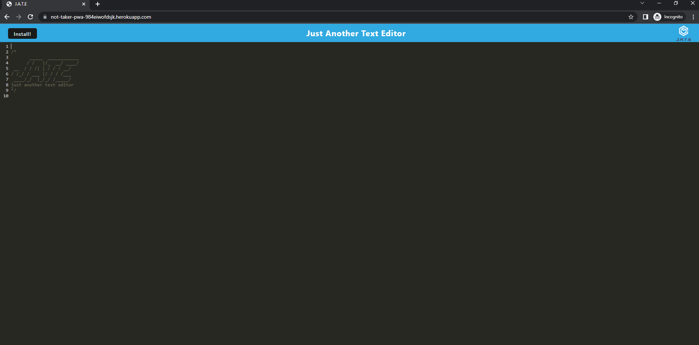
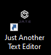
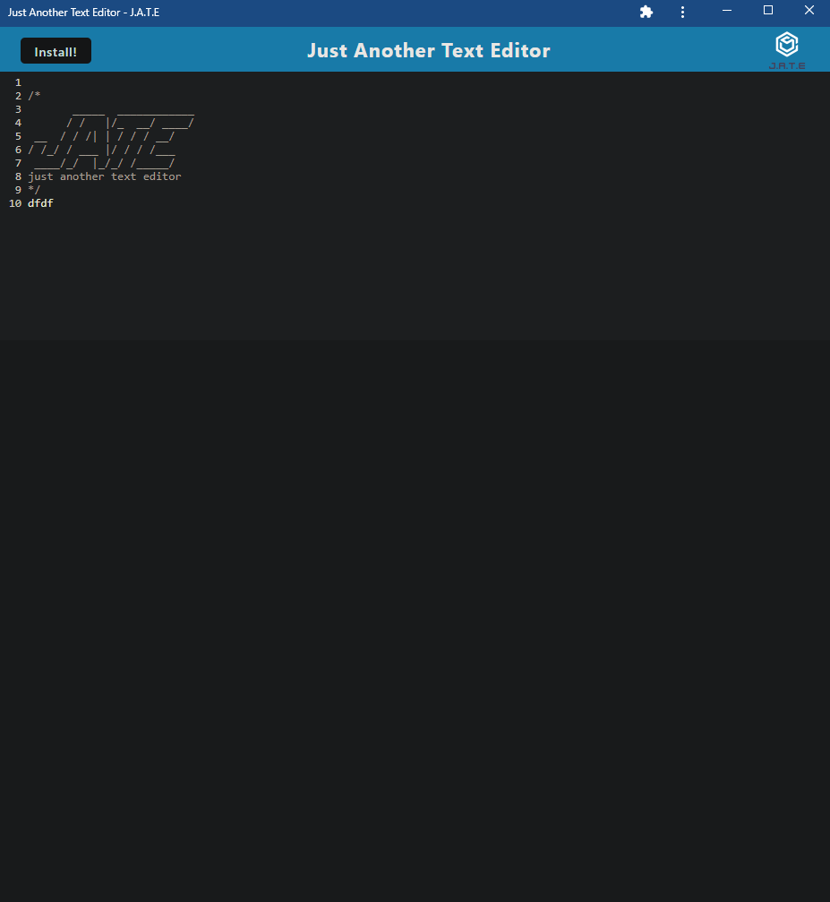

# Text Editor Starter Code

## Preview

- This website is hosted live [HERE](https://not-taker-pwa-984eiwofdsjk.herokuapp.com/)

- WEBSITE

- when you download the application you will get a desktop icon

- when you open that application you will be able to use the compiled web application

## Description

- This is PWA (progressive web application), meaning it is packaged to be able to work offline and not connected to the web! AWESOME! In this case this is done using the webpack node module, they make it pretty easy to package web applications. Otherwise this is litteraly just a simple text editor with some extra styling, but when you click install me, this web app will download, package itself, and apear as a desktop application which I think it pretty cool.

## Tech Stack

- NODE: [WebPack](https://webpack.js.org/), [Express](https://expressjs.com/), [Bable](https://babeljs.io/), [Concurrently](https://www.npmjs.com/package/concurrently).

- Live website hosting with [Heroku](https://www.heroku.com/)

## Usage

- This website is hosted live [HERE](https://not-taker-pwa-984eiwofdsjk.herokuapp.com/)

- If you want to compile or view the sourcecode yourself you can fork or download this project as a zip from my repo [HERE](https://github.com/MiloCohenElyanow/PWAText-Editor)

- Once downloaded all you have to do is open the root of the project in a console using running with NODE installed, I use Bash. and run NPM start to compile and view this web application.

- Anyone can use this code and application in any way they say fit!
